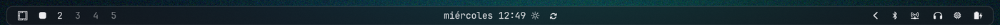
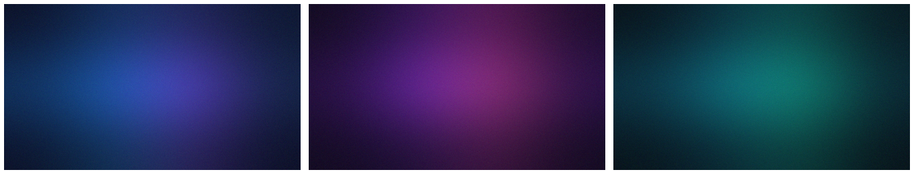
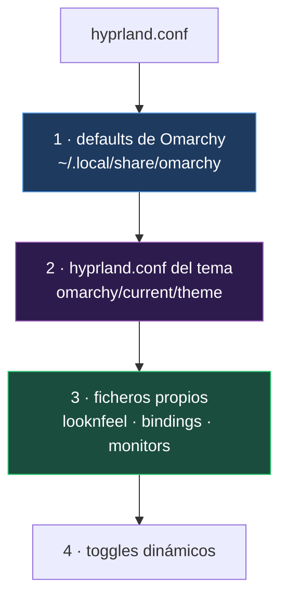

<div align="center">

# peylau-rice

**Configuración de escritorio para [Omarchy](https://omarchy.org/)** — Arch Linux + Hyprland

Incluye **iOS Glass**, un tema propio de cristal esmerilado.




</div>

---

## Qué es esto

La configuración de mi escritorio, versionada. Dos cosas la separan de un volcado de ficheros:

- **El repositorio no es una copia.** `~/.config` son enlaces simbólicos que apuntan aquí, así que la configuración viva y la versionada son el mismo fichero. No hay que sincronizar nada.
- **Sirve para detectar, no solo para restaurar.** `omarchy update` ejecuta migraciones que a veces reemplazan ficheros de `~/.config` por los de serie. Con los enlaces puestos, un `git status` después de actualizar lo canta al instante.

## El tema: iOS Glass



Cristal esmerilado al estilo de iOS y visionOS. Los cuatro detalles que lo sostienen:

| | |
|---|---|
| **Saturación bajo el cristal** | El `vibrancy` del desenfoque de Hyprland satura lo que queda detrás del panel. Es lo que distingue el cristal de visionOS de un desenfoque a secas: el color del fondo *sangra* a través. |
| **Esquinas squircle** | `rounding_power = 4`. Con el 2 de serie la esquina es un arco de circunferencia y se aprecia el corte al llegar al lado recto. Al subirlo la curvatura se vuelve continua, que es la mitad de por qué un icono de iOS se ve suave. |
| **Terminales legibles** | La transparencia la pone el terminal (`opacity` de Alacritty), no `active_opacity` de Hyprland. Este último atenuaría también el texto y dejaría la consola ilegible. |
| **Movimiento con rebote** | Curvas bezier con el punto de control por encima de 1, es decir, que pasan de su destino y vuelven. Y `workspaces` activada, que Omarchy trae apagada. |

Los fondos son degradados generados, no fotografías: se dibuja una rejilla de 4×3 píxeles y se amplía a 1920×1080 con interpolación cúbica, lo que convierte los saltos entre píxeles en un degradado continuo. Ver [`scripts/generate-wallpapers.sh`](scripts/generate-wallpapers.sh).

```bash
omarchy theme set "iOS Glass"
```

Documentación completa en **[docs/THEME.md](docs/THEME.md)**.

## Estructura

```
peylau-rice/
├── config/                  Todo lo que se enlaza a ~/.config
│   ├── hypr/                Compositor: atajos, monitores, apariencia, idle
│   ├── waybar/              Barra. Dos barras + scripts del reproductor
│   ├── walker/              Lanzador
│   ├── mako/                Notificaciones
│   ├── fish/config.fish     Saludo adaptativo del shell
│   ├── alacritty/ foot/ …   Terminales
│   ├── btop/ cava/ …        Utilidades
│   └── omarchy/
│       ├── themes/ios-glass/  El tema
│       ├── hooks/             Automatismos al cambiar de tema y tras actualizar
│       └── branding/          Logotipos ASCII
├── docs/                    Documentación
├── scripts/                 Generador de fondos
└── install.sh               Crea los enlaces
```

## Instalación

Requiere Omarchy ya instalado.

```bash
git clone https://github.com/PEYLAU/peylau-rice.git ~/Projects/peylau-rice
cd ~/Projects/peylau-rice
./install.sh --dry-run    # enseña lo que hará, sin tocar nada
./install.sh
```

Lo que hubiera en `~/.config` **no se borra**: se aparta a `~/.config/peylau-rice-backups/<fecha>/`. El script es idempotente y `./install.sh --unlink` lo deshace.

Después:

```bash
hyprctl reload
omarchy restart waybar
omarchy theme set "iOS Glass"
```

## Arquitectura

Hyprland lee un solo fichero, `~/.config/hypr/hyprland.conf`, que va incluyendo el resto. **Gana lo último que se lee**, y de ahí sale toda la lógica de personalización:



Tres consecuencias prácticas:

1. **Nunca se editan los defaults de Omarchy** (`~/.local/share/omarchy/`). Son un repositorio git que `omarchy update` actualiza; cualquier cambio ahí se pierde o genera conflictos. Se sobrescriben desde los ficheros propios, que se leen después.
2. **Un tema puede traer su propio `hyprland.conf`**, y por eso iOS Glass incluye su desenfoque, sus animaciones y sus reglas de capa. Al cambiar de tema desaparecen solas.
3. **Pero los ficheros propios ganan al tema.** `looknfeel.conf` se lee *después*, así que `rounding` se decide ahí. Está documentado en el propio fichero para que no sorprenda.

El detalle completo, incluida la cadena de plantillas de los temas y el modelo de precedencia de CSS en Waybar, está en **[docs/ARCHITECTURE.md](docs/ARCHITECTURE.md)**.

## Problemas resueltos

Dos que costaron encontrar, con su diagnóstico en **[docs/TROUBLESHOOTING.md](docs/TROUBLESHOOTING.md)**:

**Esquinas cuadradas asomando tras el redondeo de Waybar.** Intermitente y sin patrón aparente. La causa no estaba en el CSS: con un fondo 100 % opaco, GTK declara toda la superficie Wayland como opaca y Hyprland se salta el blending, pintando el rectángulo entero. Depende de qué haya debajo de la barra, de ahí lo intermitente. Se arregla con un alpha de `0.99`, que es invisible pero basta para que GTK no declare la región opaca.

**Fastfetch descuadrado en terminales estrechos.** No es un problema de escala: fastfetch emite **siempre** líneas de 117 columnas, mida lo que mida el terminal. Un terminal a media pantalla da unas 80 y el texto se envuelve. El saludo de fish ahora quita el logo por debajo del umbral, con lo que la salida baja a 55 columnas sin perder información.

## Mantenimiento

```bash
git status              # ¿qué me ha cambiado la última actualización?
git diff                # ¿y exactamente qué línea?
git checkout -- <ruta>  # devolver un fichero a como estaba
```

`config/omarchy/current/` no se versiona: son ficheros generados en cada cambio de tema.

## Licencia

[MIT](LICENSE). Los logotipos ASCII de `config/omarchy/branding/` pertenecen al proyecto Omarchy.
