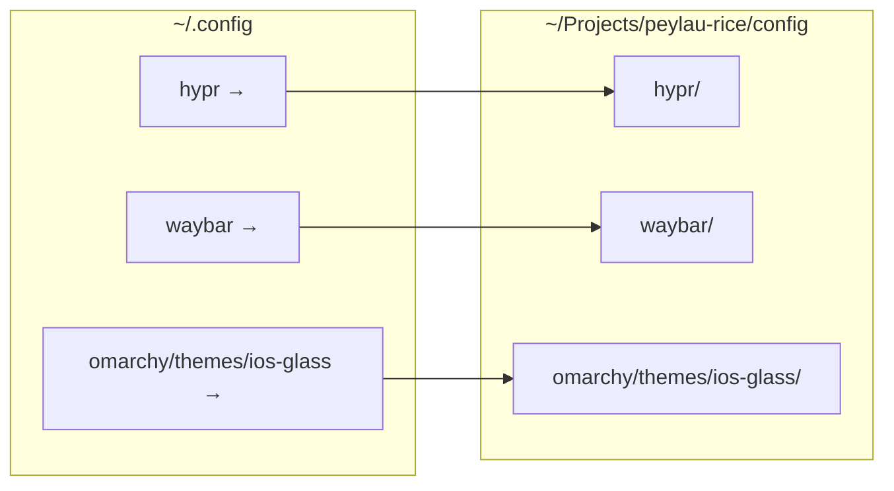
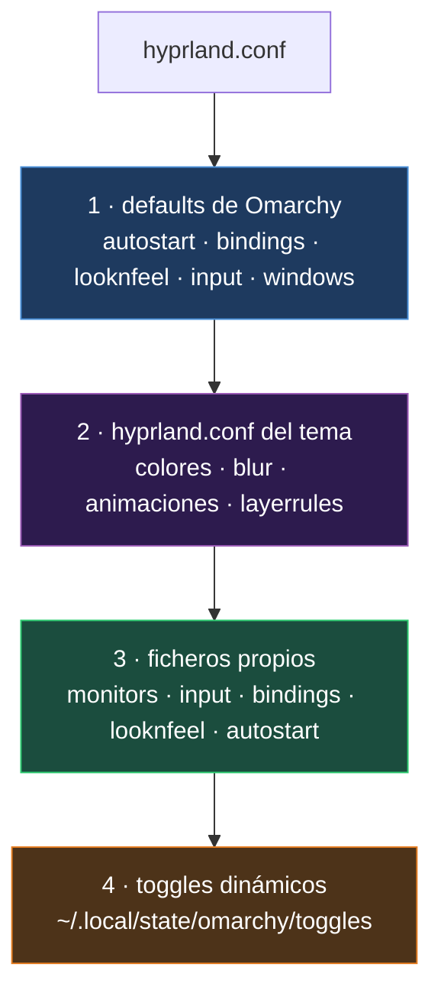
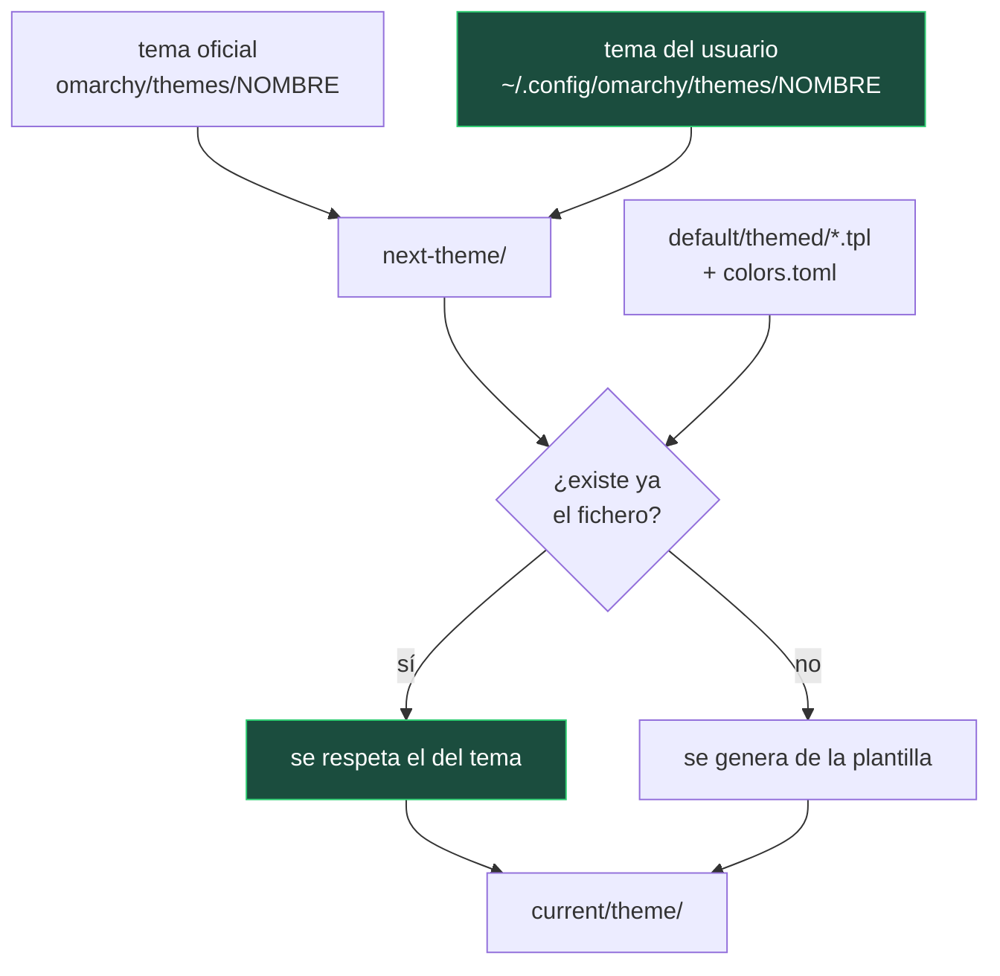
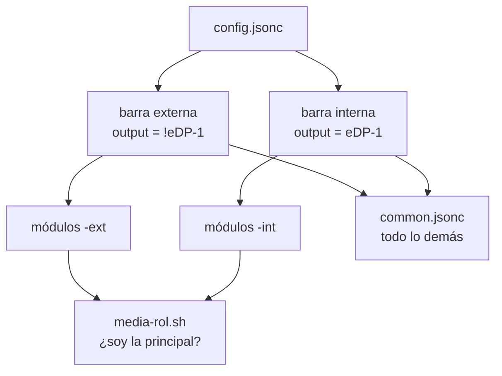

# Arquitectura

Cómo encajan las piezas y por qué están donde están. Cuatro sistemas de
precedencia distintos conviven aquí, y casi todas las sorpresas al personalizar
Omarchy salen de confundir uno con otro.

---

## 1. El repositorio y `~/.config`

`~/.config` no contiene copias de este repositorio: contiene **enlaces
simbólicos** que apuntan a él.



La alternativa habitual —copiar los ficheros al repo y sincronizar a mano— falla
por el motivo de siempre: lo que no se automatiza se olvida. Y aquí el olvido es
caro, porque el objetivo no es solo poder restaurar, sino **enterarse** de que
algo ha cambiado. Con los enlaces, editar la configuración *es* editar el repo,
y `git status` responde a la pregunta «¿qué me ha tocado la última actualización
de Omarchy?» sin que haya que acordarse de nada.

### El nivel al que se enlaza importa

No todo se enlaza al mismo nivel, y no es arbitrario:

| Ruta | Nivel | Motivo |
|---|---|---|
| `hypr/`, `waybar/`, `mako/`… | Directorio entero | Solo contienen configuración |
| `fish/config.fish` | Fichero suelto | `fish_variables` lo reescribe fish sola, con rutas absolutas de esta máquina |
| `omarchy/themes/ios-glass` | Subdirectorio | La carpeta `omarchy/` contiene además `current/`, 7 MB de ficheros generados en cada cambio de tema |

La regla general: **enlazar tan arriba como se pueda, pero nunca por encima de
algo que se genere o que sea específico de la máquina.**

### Efecto secundario útil

Algunas migraciones de Omarchy borran temas de usuario cuando esos temas pasan a
ser oficiales, pero comprueban antes si son un enlace:

```bash
if [[ ! -L ~/.config/omarchy/themes/hackerman ]]; then
  rm -rf ~/.config/omarchy/themes/hackerman
  ...
fi
```

Al estar `ios-glass` enlazado, esa comprobación lo protegería.

---

## 2. Hyprland: gana el último que se lee

`~/.config/hypr/hyprland.conf` no configura casi nada por sí mismo. Lo que hace
es incluir otros ficheros en un orden concreto, y **en Hyprland el último valor
leído sobrescribe a los anteriores**.



### Por qué nunca se editan los defaults

La capa 1 vive en `~/.local/share/omarchy/`, que es un repositorio git que
`omarchy update` actualiza con `git pull`. Editar ahí significa perder los
cambios en la siguiente actualización, o provocar un conflicto que rompe el
mecanismo de actualización entero. Como la capa 3 se lee después, **cualquier
default se sobrescribe desde los ficheros propios sin tocar el original**.

### La trampa: el tema pierde contra tus ficheros

La capa 2 es el tema y la capa 3 son los ficheros propios. Es decir, **un valor
que aparezca en ambos se decide en el fichero propio.** Hoy afecta a tres:

| Valor | Lo pide el tema | Lo decide |
|---|---|---|
| `decoration:rounding` | 14 | `config/hypr/looknfeel.conf` |
| `decoration:rounding_power` | 4 | `config/hypr/looknfeel.conf` |
| `groupbar:gradient_rounding` | 14 | `config/hypr/looknfeel.conf` |

El tema los declara igualmente, para que siga siendo completo si se lleva a otra
máquina, y `looknfeel.conf` lleva un comentario explicando por qué esos números
tienen que coincidir. Todo lo demás del tema (desenfoque, sombras, colores de
borde, animaciones, reglas de capa) no aparece en los ficheros propios, así que
se aplica tal cual y **desaparece solo al cambiar de tema**.

---

## 3. Temas de Omarchy: plantillas y precedencia

Un tema no es una carpeta de ficheros que se copian. `omarchy theme set` genera
el tema activo en tres pasos:



Las plantillas son sustitución de texto: `{{ background }}` se cambia por el
valor de `colors.toml`, y hay variantes `{{ background_rgb }}` (decimal, para
`rgba()`) y `{{ background_strip }}` (sin la almohadilla).

**La regla que hace posible el cristal** está en
`omarchy-theme-set-templates`: una plantilla solo se aplica *si el fichero no
existe ya*. Por eso iOS Glass puede traer su propio `waybar.css` con
transparencias en vez del que generaría la plantilla, que solo sabe escribir
colores hexadecimales opacos.

Lo que se genera solo a partir de `colors.toml` (btop, helix, obsidian,
chromium, vscode, swayosd, el selector de pantalla compartida…) no hace falta
incluirlo en el tema.

---

## 4. Waybar: el orden no manda, la especificidad sí

`config/waybar/style.css` importa el CSS del tema **en su primera línea**:

```css
@import "../omarchy/current/theme/waybar.css";
```

Es fácil deducir de ahí que lo del usuario, al ir después, siempre gana. **Es
falso.** En CSS el orden solo desempata entre selectores de la *misma*
especificidad. Para imponerse hay que subir la especificidad.

El tema lo aprovecha en dos sitios:

| Selector del tema | Compite contra | Quién gana |
|---|---|---|
| `window#waybar { border }` | `* { border: none }` | El tema: id + elemento (1,0,1) frente al universal (0,0,0) |
| `tooltip.background { background-color }` | `tooltip { background-color }` | El tema: elemento + clase (0,1,1) frente a elemento (0,0,1) |

El segundo caso resuelve un problema real. Los tooltips son superficies GTK
aparte y **no los alcanza la regla de desenfoque del namespace `waybar`**, así
que con el 42 % de opacidad de la barra quedarían ilegibles sobre el escritorio.
La regla de mayor especificidad les da un fondo casi sólido propio.

### `alpha()` multiplica, no fija

`style.css` pinta la barra con `alpha(@background, 0.99)` y el tema define
`@background` ya con transparencia. Los dos valores **se combinan**: el 0.42 del
tema acaba en 0.416 en pantalla. El `0.99` no es decorativo, es el arreglo de un
bug de compositing que se explica en [TROUBLESHOOTING.md](TROUBLESHOOTING.md).

---

## 5. Las dos barras de Waybar

Waybar **no permite limitar un módulo a un monitor**: `output` existe a nivel de
barra, no de módulo. Para que el reproductor aparezca solo en la pantalla
principal se definen dos barras completas:



El `!` excluye un monitor, así que la barra «externa» solo existe cuando hay algo
conectado que no sea la pantalla del portátil. Al desconectarlo, Waybar destruye
esa barra sola.

Cuál de las dos *muestra* el reproductor no se decide en la configuración: cada
juego de módulos le pasa su papel (`externo` / `interno`) a los scripts, y estos
se ocultan si su monitor no es el principal en ese momento. Por eso el salto de
una barra a otra es automático al conectar o desconectar, sin reiniciar nada.

Todo lo que no difiere entre ambas vive en `common.jsonc`, que las dos incluyen.

### El visualizador de audio

`scripts/cava.sh` es el único script del reproductor que se queda corriendo,
porque tiene que mantener vivo a `cava`. Waybar **no mata sus scripts al
reiniciarse**, solo les cierra la salida, así que lleva tres protecciones para no
acumular procesos huérfanos:

1. `trap` que mata a `cava` y a su `awk` al terminar
2. Comprobación del PPID: si Waybar murió, el script sobra
3. Si `awk` ha muerto de SIGPIPE, es que Waybar cerró la salida

`cava` escribe a un FIFO y `awk` lo lee, cada uno con su PID localizado. Con una
tubería normal (`cava | awk &`) `$!` sería el PID de `awk` y `cava` quedaría vivo.

---

## 6. El saludo del shell

`config.fish` sustituye al `fish_greeting` de CachyOS porque **fastfetch no se
adapta al ancho del terminal**: con esta configuración emite siempre líneas de
117 columnas (54 del logo + 8 de relleno + 54 de las cajas). Por debajo de ese
umbral se lanza sin logo, con lo que la salida baja a 55 columnas y no se pierde
información.
