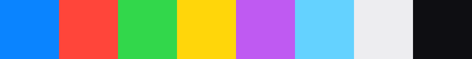

# iOS Glass

Tema de cristal esmerilado inspirado en iOS y visionOS.

```bash
omarchy theme set "iOS Glass"
```

---

## Paleta

Los colores de sistema de Apple en su variante para modo oscuro, sobre un
grafito muy oscuro con un punto de azul.



| | Papel | Color | Nombre en iOS |
|---|---|---|---|
| 1 | Acento | `#0A84FF` | systemBlue |
| 2 | Rojo | `#FF453A` | systemRed |
| 3 | Verde | `#32D74B` | systemGreen |
| 4 | Amarillo | `#FFD60A` | systemYellow |
| 5 | Morado | `#BF5AF2` | systemPurple |
| 6 | Cian | `#64D2FF` | systemTeal |
| 7 | Texto | `#EDEDF0` | — |
| 8 | Fondo | `#0E0E12` | — |

`colors.toml` guarda **solo hexadecimal opaco**, porque es lo que consumen las
plantillas de Omarchy. Las transparencias viven en los ficheros que el tema trae
ya hechos.

---

## Las cuatro decisiones

### 1. El desenfoque satura, no oscurece

Omarchy desenfoca de serie con `brightness = 0.60`, que apaga lo que hay debajo.
El cristal de iOS hace lo contrario: ilumina y satura.

```ini
brightness = 0.92        # casi neutro
contrast   = 1.05
vibrancy   = 0.35        # ← el ingrediente de visionOS
noise      = 0.02        # grano contra el banding
xray       = false       # recoge también las ventanas de debajo
```

`vibrancy` satura lo que queda detrás del panel: es lo que hace que el color del
fondo *sangre* a través del cristal en vez de quedar en un gris lavado.

`xray = false` es más caro de calcular, pero es lo que separa un panel de cristal
de un recorte del fondo de escritorio: con `true` solo se desenfoca el wallpaper,
ignorando las ventanas.

El `noise` no es un adorno. Un degradado sintético perfecto produce bandas
visibles en pantallas de 8 bits, y el grano las rompe.

### 2. Squircle, no circunferencia

```ini
rounding       = 14
rounding_power = 4
```

Con `rounding_power = 2` —el valor de serie— la esquina es un arco de
circunferencia: la curva arranca de golpe y se nota el cambio al entrar en el
lado recto. Al subirlo la curvatura se vuelve continua, la curva empieza antes y
se funde con el lado. Es el *squircle* de Apple, y es la mitad de por qué un
icono de iOS se ve suave.

> Estos dos valores se deciden en `config/hypr/looknfeel.conf`, no aquí. Ver
> [ARCHITECTURE.md](ARCHITECTURE.md#2-hyprland-gana-el-último-que-se-lee).

### 3. La transparencia la pone el terminal

```toml
# config/omarchy/themes/ios-glass/alacritty.toml
[window]
opacity = 0.85
```

**No** se usa `active_opacity` de Hyprland. La diferencia es lo que decide si el
terminal se puede usar: Hyprland atenuaría la ventana entera, texto incluido, y
dejaría la consola lavada e ilegible. Con `opacity` del terminal solo se vuelve
translúcido el fondo, y las letras siguen a opacidad completa. El desenfoque de
lo que se ve a través lo sigue poniendo Hyprland.

Comprobado midiendo el píxel de fondo: `srgb(17,20,33)` en lugar del opaco
`srgb(14,14,18)`, y variando con la posición (29 → 40 en el canal azul) porque
recoge distintas zonas del fondo desenfocado.

### 4. El movimiento rebota

```ini
bezier = iosOut, 0.32, 1.28, 0.38, 1
```

Ese `1.28` es un punto de control **por encima de 1**: la curva pasa de su
destino y vuelve. Eso es el rebote. Con valores de 1 o menos la animación solo
frena, que es lo que hace `easeOutQuint` de serie: correcto, pero inerte.

Al cerrar no se rebota. Un rebote a la salida parece que la ventana se resiste a
irse, así que `windowsOut` usa una curva corta y limpia.

```ini
animation = workspaces, 1, 3.2, iosOut, slide
```

Omarchy trae esta animación **desactivada** (`0`). Activarla es el cambio que más
se nota del tema entero: cambiar de escritorio pasa de un corte seco a un
deslizamiento.

---

## Reglas de capa

Los paneles que no son ventanas (barra, lanzador, notificaciones) necesitan su
propia regla:

```ini
layerrule = blur on,        match:namespace waybar
layerrule = ignore_alpha 0.1, match:namespace waybar
```

Dos cosas que cuestan un rato descubrir:

**La sintaxis cambió.** Desde Hyprland 0.53 la forma es `<regla> <valor>,
match:namespace <ns>`. La antigua `layerrule = blur,waybar` ya no se acepta y
falla con `invalid field blur: missing a value`.

**`ignore_alpha` evita un halo.** Sin él, Hyprland desenfoca también los píxeles
completamente transparentes que rodean al panel redondeado, y aparece un cerco
borroso **cuadrado** alrededor. El umbral debe quedar por debajo del alpha del
panel, o se desenfocaría el panel entero hasta desaparecer.

Los namespaces reales se consultan con `hyprctl layers`; aquí son `waybar`,
`walker` y `notifications`.

---

## Niveles de opacidad

No todo lleva la misma transparencia, y sigue un criterio:

| Superficie | Opacidad | Por qué |
|---|---|---|
| Barra | 0.42 | Adorno: manda el efecto |
| Lanzador | 0.62 | Listas y texto pequeño: manda el contraste |
| Notificaciones | 0.66 | Se leen de un vistazo y sobre cualquier fondo |
| Terminales | 0.85 | Texto denso durante minutos |
| Tooltips | 0.97 | **No los alcanza el desenfoque** (superficie GTK aparte) |

Es el mismo criterio de iOS: los paneles con contenido denso son más sólidos que
los decorativos.

---

## Los fondos

Tres degradados generados, no fotografías:

| | |
|---|---|
| `1-aurora` | Azules profundos con una diagonal índigo |
| `2-twilight` | Violeta a magenta. El que más luce el `vibrancy` |
| `3-abyss` | Verde azulado frío. El más oscuro: máximo contraste para el texto |

El truco está en [`scripts/generate-wallpapers.sh`](../scripts/generate-wallpapers.sh):
se dibuja una rejilla de **4×3 píxeles** con los colores en su sitio y se amplía
a 1920×1080 con interpolación cúbica. Al escalar ×480 la interpolación se
convierte en un degradado continuo entre los píxeles. Es la forma más corta de
conseguir un *mesh gradient* sin librerías de gráficos.

Después se le añade grano fino, por el mismo motivo que al desenfoque: romper el
banding.

Para regenerarlos o cambiar los colores:

```bash
./scripts/generate-wallpapers.sh config/omarchy/themes/ios-glass/backgrounds
```

Los fondos propios que no quieras versionar van en
`~/.config/omarchy/backgrounds/ios-glass/`, que Omarchy mezcla con los del tema
al ciclar con `omarchy theme bg next`.

---

## Rendimiento

`size = 8` con `passes = 3` va sobrado en 1080p. El coste es el producto de
ambos: si notaras tirones, **baja `passes` a 2 antes que `size`** — cuesta menos
y se nota mucho menos.
