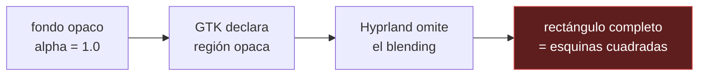

# Diagnósticos

Problemas que costaron encontrar, con el razonamiento y la medición que los
cerró. Se documentan porque en los dos casos **la causa no estaba donde parecía**.

---

## Esquinas cuadradas asomando tras el redondeo de Waybar

**Síntoma.** De vez en cuando aparecían esquinas cuadradas por detrás de las
esquinas redondeadas de la barra. No siempre, no de forma reproducible, y sin
patrón evidente.

### Por qué no era lo que parecía

El primer sospechoso fue `cava`, porque es lo único de la barra que se refresca
constantemente. **No tenía nada que ver**: `cava.sh` solo escribe texto en un
módulo, no toca el fondo de la barra ni su geometría.

El segundo sospechoso fue el CSS, y también estaba descartado de antemano: si
fuera un problema de reglas, fallaría **siempre**, no a ratos.

Que un fallo sea intermitente es información. Descarta cualquier causa estática y
apunta a algo que depende del **estado** del sistema en ese momento.

### La causa

Está en la frontera entre GTK y el compositor.

Cuando el fondo de la ventana es **100 % opaco**, GTK declara toda la superficie
Wayland como opaca mediante `wl_surface.set_opaque_region`. Es una optimización
legítima: le dice al compositor «detrás de esto no se ve nada, no te molestes en
mezclar».

Hyprland la aprovecha y **se salta el blending**, pintando el rectángulo
completo. Y un rectángulo completo no tiene esquinas redondeadas.

La intermitencia encaja: que Hyprland tome ese atajo depende de qué haya debajo
de la barra en ese momento y de cómo estén las regiones de daño.



### El arreglo

```css
window#waybar {
  background-color: alpha(@background, 0.99);
}
```

Ese 1 % es invisible, pero basta para que GTK **no** declare la región opaca. Sin
esa declaración, Hyprland mezcla siempre y el redondeo se respeta.

> Con el tema iOS Glass el problema no puede darse: la barra está al 42 % y nunca
> es opaca. El `alpha()` protege al resto de temas.

Referencia: [Waybar #3850](https://github.com/Alexays/Waybar/issues/3850).

---

## Fastfetch descuadrado en terminales estrechos

**Síntoma.** En un terminal a media pantalla, la salida de `fastfetch` se
envolvía y caía encima del logotipo. Al estirar la ventana «se arreglaba».

### Por qué no era un problema de escala

Que se arregle al estirar sugiere escalado o fuente, pero la medición dice otra
cosa. Ejecutando fastfetch en un pty de ancho controlado:

| Ancho del terminal | Línea más larga emitida | |
|---|---|---|
| 80 | 117 | desborda |
| 100 | 117 | desborda |
| 116 | 117 | desborda |
| 120 | 117 | cabe |

**Fastfetch emite siempre 117 columnas**, mida lo que mida el terminal. No se
adapta. El desglose:

| Parte | Columnas |
|---|---|
| Logotipo (`branding/about.txt`) | 54 |
| Relleno del logotipo (2 izquierda + 6 derecha) | 8 |
| Cajas de información | 54 |
| **Total** | **117** |

Un terminal a media pantalla da unas 80. Faltan 37 columnas y el texto envuelve.

Y por eso al estirar «se arregla»: no se recalcula nada, simplemente ya caben las
117 y deja de haber envoltura. El terminal reflujó el texto que ya estaba escrito.

### El arreglo

Lo único que sobra es el logotipo. Sin él la salida ocupa 55 columnas y no se
pierde información, así que el saludo decide según el ancho:

```fish
function fish_greeting
    if test "$ancho" -ge 117
        fastfetch
    else
        fastfetch --logo none
    end
end
```

Verificado a 80 columnas (55 emitidas) y a 130 (117 emitidas). Ninguna envuelve.

> `--logo small` no sirve: sigue dando 117 columnas.

---

## Comprobaciones útiles

```bash
hyprctl configerrors          # vacío = configuración válida
hyprctl layers                # namespaces reales, para las layerrules
hyprctl getoption <clave>     # valor efectivo tras toda la cadena de precedencia
hyprctl animations            # qué animación está activa y con qué curva
```

`hyprctl keyword` **valida** antes de aplicar, así que sirve para probar sintaxis
sin tocar ficheros:

```bash
hyprctl keyword layerrule "blur on, match:namespace waybar"   # ok
hyprctl keyword layerrule "blur,waybar"                       # invalid field blur: missing a value
```

Los cambios hechos con `hyprctl keyword` no persisten: `hyprctl reload` los borra.

### Waybar no recarga el CSS solo

```bash
omarchy restart waybar
```

Hyprland sí recarga al guardar, pero Waybar no. Los errores de CSS aparecen en
`journalctl --user -b | grep waybar`.

### Un valor del tema no se aplica

Casi siempre es la precedencia: `config/hypr/looknfeel.conf` se lee **después**
del `hyprland.conf` del tema y gana. Ver
[ARCHITECTURE.md](ARCHITECTURE.md#la-trampa-el-tema-pierde-contra-tus-ficheros).

```bash
hyprctl getoption decoration:rounding    # el valor que manda de verdad
```

### Deshacer los enlaces

```bash
./install.sh --unlink
```

Restaura ficheros reales en `~/.config` a partir del repositorio. Solo toca
enlaces que apunten a este repositorio; lo que haya puesto otra cosa se respeta.
